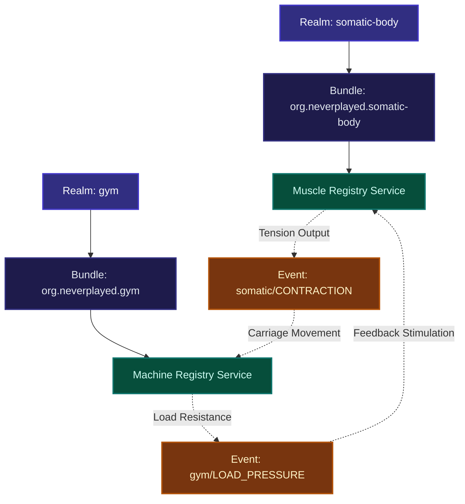

# Somatic Gym Experiment (Kieser Training Simulation)

This document details the implementation plan for configuring and exploring a bio-cybernetic gym environment within the Never Played OSGi/Stratum framework. 

The user (`dd` / Daniel Doegl) and their physical somatic body are modeled as an inhabitant realm of muscles, which dynamically couples and interacts with a physical gym environment realm populated by specific exercise machines.

---

## 🧬 Ontological Modeling (Matter to Meaning)

The experiment maps the Kieser Training regime described in [.agents/memory/explorations/gym.md](../../gym.md) across the constitutional information layers:

*   **L0: Realm (Physics)**: Mechanical weight resistance (load) and somatic muscle contraction (tension) are the physical substrates.
*   **L1: Identity (Beings)**: 
    *   **User Being**: `dd` (Daniel Doegl), the conscious agent experiencing the workout.
    *   **Muscle Beings**: Individual muscle entities (e.g., `GluteusMedius`, `Quadriceps`, `Deltoideus`, `Beckenboden`) inside the body realm.
    *   **Machine Beings**: Individual training machines (e.g., `B6_LegPress`, `B1_LegExtension`, `A3_Abduction`) inside the gym.
*   **L2: Stratum (Residency Floors)**:
    *   `org.neverplayed.realm.somatic-body`: The resident layer representing the user's anatomical systems.
    *   `org.neverplayed.realm.gym`: The resident layer representing the external training facility.
*   **L4: Symbols & L5: Semantics (Events & Traces)**:
    *   **Somatic Contraction Topic**: `org/neverplayed/somatic/CONTRACTION` broadcasts muscle tension.
    *   **Machine Pressure Topic**: `org/neverplayed/gym/LOAD_PRESSURE` broadcasts machine-applied weight force.
    *   **Stigmergic Feedback**: Bidirectional coupling where machine load raises muscle tension, and muscle tension moves the machine's carriage, producing homeostatic comfort or prediction errors.
*   **L6: Surrogate (Functional Proxies)**:
    *   `muscle-nervous-system`: Direct surrogate allowing the `dd` Being to perceive tension spikes inside the body realm.
    *   `gym-goer`: Dynamic surrogate allowing the occupant to operate, adjust weights, and contract muscles on the machines.

---

## Proposed Changes



### 1. Realms and Declarative Configuration

We will establish two new realms and populate them with beings and surrogates using our standard YAML loader.

#### [NEW] [somatic-body.json](../../../../public/realms/somatic-body.json)
*   Declares `org.neverplayed.realm.somatic-body`.
*   Recognizes surrogates: `observer`, `muscle-nervous-system`.
*   Hooks the new bundle `./bundles/org.neverplayed.somatic-body/manifest.json`.

#### [NEW] [gym.json](../../../../public/realms/gym.json)
*   Declares `org.neverplayed.realm.gym`.
*   Recognizes surrogates: `observer`, `gym-goer`.
*   Hooks the new bundle `./bundles/org.neverplayed.gym/manifest.json`.

#### [NEW] [beings.yaml (somatic-body)](../../../../public/realms/data/somatic-body/beings.yaml)
*   Registers `dd` (Daniel Doegl) as the host Being.
*   Registers individual anatomical muscle beings:
    *   `gluteus-medius` (Abduktion)
    *   `beckenboden` (Pelvic Floor)
    *   `quadriceps` (Leg Press & Leg Extension)
    *   `ischiocrurale` (Leg Curl)
    *   `deltoideus` (Overhead & Chest Press)
    *   `pectoralis` (Chest Press)
    *   `latissimus` (Torso Arm)
    *   `rhomboiden` (Rowing)
    *   `abdominalis` (Abdominal)
    *   `erector-spinae` (Lower Back)

#### [NEW] [surrogates.yaml (somatic-body)](../../../../public/realms/data/somatic-body/surrogates.yaml)
*   Declares `muscle-nervous-system` equipped with the `SomaticSensation` sense.

#### [NEW] [beings.yaml (gym)](../../../../public/realms/data/gym/beings.yaml)
*   Registers the 12 Kieser Training machines as individual Being entities:
    *   `machine-a5` (Pelvic Floor)
    *   `machine-a3` (Abduction)
    *   `machine-b6` (Leg Press)
    *   `machine-b1` (Leg Extension)
    *   `machine-b7` (Leg Curl)
    *   `machine-e1` (Overhead Press)
    *   `machine-d6` (Chest Press)
    *   `machine-c3` (Torso Arm)
    *   `machine-c7` (Rowing)
    *   `machine-f2.1` (Abdominal)
    *   `machine-f3.1` (Lower Back)
    *   `machine-j9` (Cable Station)

#### [NEW] [surrogates.yaml (gym)](../../../../public/realms/data/gym/surrogates.yaml)
*   Declares `gym-goer` equipped with the `WeightResistance` and `MachineInteraction` senses.

---

### 2. Somatic and Gym OSGi Bundles

We will create two pure OSGi bundles that interact dynamically to establish the biosemiotic feedback loop.

#### [NEW] [org.neverplayed.somatic-body manifest & activator](../../../../public/bundles/org.neverplayed.somatic-body/activator.js)
*   Registers a `MuscleRegistryService` under the interface `org.neverplayed.somatic.MuscleRegistry`.
*   Maintains a state map of all 10 muscle groups and their active **somatic tension** (0-100%).
*   Exposes a method `exertForce(muscleId, intensity)` which sets tension, tracks fatigue, and broadcasts `org/neverplayed/somatic/CONTRACTION` via `EventAdmin`.
*   Subscribes to `org/neverplayed/gym/LOAD_PRESSURE` events. When weight pressure is applied by a machine, it automatically stimulates the target muscles, causing reflexive tension spike (proprioception).

#### [NEW] [org.neverplayed.gym manifest & activator](../../../../public/bundles/org.neverplayed.gym/activator.js)
*   Registers a `GymMachineService` under `org.neverplayed.gym.MachineRegistry`.
*   Exposes methods to select/sit in a machine (`selectMachine(machineId)`) and configure weight plates (`setWeight(weightKg)`).
*   When a machine is active, it broadcasts `org/neverplayed/gym/LOAD_PRESSURE` at a regular frequency, supplying weight pressure to the somatic body.
*   Listens to `org/neverplayed/somatic/CONTRACTION`. If the user's corresponding muscles exert enough force to overcome the weight:
    *   The machine's leverage carriage moves (state shifts from `resting` to `contracted`).
    *   It updates the TAME loop configuration, reducing the local *prediction error* in `RealmCognitionService` (representing homeostatic satisfaction).
    *   Triggers real-time perceptual updates via Plexus Sensor, printing physical feedback statements to the developer CLI.

---

### 3. Stratographer HUD Integration

#### [MODIFY] [dashboard.html](../../../../public/bundles/org.neverplayed.stratographer/templates/dashboard.html)
We will customize the glassmorphic **Somatic HUD** right tab-pane panel so that when the active realm is `org.neverplayed.realm.somatic-body` or `org.neverplayed.realm.gym`, it swaps the generic OSGi heap and PID monitors for a custom, high-fidelity **Biomechanical Telemetry Panel**:

*   **Muscle Tension Gauges**: Displays live contractile percentage meters for the active muscle group.
*   **Machine Lever Status**: A dynamic visualization showing the selected Kieser Machine (e.g., "Leg Press B6"), the set weight (e.g., "120 kg"), and the mechanical lever status (RESTING, EXERTING, STABLE).
*   **Afferent/Efferent Neural Arc**: A micro-animated representation of the feedback loop (Weights → Sensory Nerve → Spinal Arc → Motor Nerve → Muscle Contraction).

---

### 4. Verification & Testing

#### [NEW] [somatic-gym.test.ts](../../../../tests/somatic-gym.test.ts)
A Deno integration test validating the entire neurological loop:
1. Boot strap both `org.neverplayed.realm.somatic-body` and `org.neverplayed.realm.gym`.
2. Login user `dd` to the somatic-body realm, verify muscle registration.
3. Switch to gym realm, set weight on Leg Press B6 to 100kg.
4. Verify the machine applies `LOAD_PRESSURE` to the `quadriceps` and `gluteus-medius`.
5. Exert muscle force on `quadriceps` above threshold, assert machine moves to `contracted` state.
6. Verify TAME loop prediction error drops to `0.0`.

---

## 🎯 Verification Plan

### Automated Tests
*   Run the complete integration suite:
    ```bash
    deno task test tests/somatic-gym.test.ts
    ```

### Manual Verification
*   Boot the headless environment and inspect the newly loaded gym nodes, link paths, and muscle states using the Deno terminal:
    ```bash
    deno task terminal
    ```
*   Select the somatic/gym nodes on the Stratographer dashboard and observe the custom Biomechanical Telemetry gauges in the right HUD pane.
