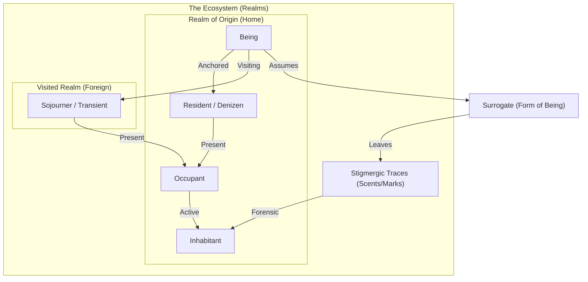

# Project Ontology: Beings, Inhabitation & Perception

This document formalizes the ecological, sovereign, and worldbuilding ontology of the *Never Played* ecosystem. It defines the spiritual and physical concepts of beings, their spatial residency, and how their perception is mediated through form.

---

## 1. Core Entities: The Spectrum of Existence

Existence in the ecosystem is categorized by a being's origin, their current presence, and their transient status.

### The Being (L1)
*   **Definition:** The primary, sovereign entity (the "soul", identity, or credentials). 
*   **Properties:** Unique global ID, email anchor, and a bag of possessed surrogates.
*   **Lifetime:** Permanent across all realms and session resets.

### Resident / Denizen / Native (Roots)
*   **Definition:** A being with a formal, anchored "home base" or permanent attachment to a specific realm (their jurisdiction or realm of origin).
*   **Relationship:** Every being has exactly one native origin realm where they are born/anchored (`originRealmId`).
*   **Lifetime:** Permanent association.

### Sojourner / Transient / Visitor
*   **Definition:** A being who is temporarily present in a realm other than their origin.
*   **Relationship:** They are a traveler passing through, occupying space without native roots.
*   **Lifetime:** Volatile (ends when the being departs the realm).

### Occupant
*   **Definition:** Any being currently active and session-logged into a given realm (either as a present resident or as a visitor).
*   **Relationship:**
    $$\text{Occupants} = \text{Present Residents} \cup \text{Present Visitors}$$
*   **Lifetime:** Volatile (bound to the active session state).

### Trace-Maker (Forensic/Historical Presence)
*   **Definition:** A being who is not currently logged into the realm but has left behind persistent digital or physical footprints in the realm's persistence stratum.
*   **Relationship:** They represent the forensic signature of a past actor. Under the Realist perspective, they are visualized as amber "ghosts" in the topology.
*   **Lifetime:** Persistent (remains as long as their traces exist in the database, even if the being is offline).

### Inhabitant
*   **Definition:** Any being with any form of presence (either active session-bound or forensic trace-bound) in a given realm.
*   **Relationship:** The union of active occupants and forensic trace-makers:
    $$\text{Inhabitants} = \text{occupants} \cup \text{traceMakers}$$
*   **Lifetime:** Dynamic (extends from active session occupancy to historical persistence footprints).

---

## 2. Forms of Being: Surrogates & Reification

Beings cannot interact with realms directly in their raw L1 state. They must manifest through physical or functional forms.

### Surrogates (L6)
*   **Definition:** A specific "form of being" or persona assumed by a being.
*   **Reification:** Realms are sovereign jurisdictions; they only reify (make real) particular surrogates. For example, the *Governance* realm may only reify the `person` surrogate, whereas the *Habitat* realm may reify `agent` or `being`.
*   **Equipping:** A being "wears" a surrogate to interact with a realm's structural objects.

### Stigmergic Traces (Scents & Marks)
*   **Definition:** The physical or digital footprints left behind by a surrogate in the soil of a realm.
*   **Sensing:** Surrogates leave sensible marks (`data-mark` configurations, database entries, files) that can only be perceived by other surrogates equipped with matching senses.

---

## 3. Perception & Perspectives

Perception is not absolute; it is mediated by the observer's grounding and perspective.

### Idealist Perspective
*   **Concept:** Subjective experience. The world as experienced by the individual observer.
*   **Visibility:** Co-residency and co-inhabitation are hidden. A surrogate cannot directly see other beings; they can only sense the **stigmergic traces** (scents/marks) left behind by others, interpreting their presence indirectly.

### Realist Perspective
*   **Concept:** Objective structure. The world as it structurally is, regardless of who is observing.
*   **Visibility:** Co-residency and co-inhabitation are fully visible. The observer sees the active population (both Natives and Sojourners) as individual nodes in the topology.

---

## 4. Architectural Mapping (Code vs. Ideal)

To maintain code integrity, the translation between this ontological ideal and the actual TypeScript/JavaScript implementation is mapped as follows:

| Ontological Concept | Technical Implementation | File Reference |
|---|---|---|
| **Being (L1)** | `session.activeBeingId` / `session.currentUser.id` | [session-service/activator.js](file:///Users/ddoegl/speckit/neverplayed/public/bundles/org.neverplayed.session-service/activator.js) |
| **Native Resident** | `currentUser.originRealmId` / `being.originRealmId` | [being-service/data/beings.yaml](file:///Users/ddoegl/speckit/neverplayed/public/bundles/org.neverplayed.being-service/data/beings.yaml) |
| **Volatile Occupant** | `stratum.occupants` (or `residents` alias) / `scopedUsers[realmId]` | [stratum-core/activator.js](file:///Users/ddoegl/speckit/neverplayed/public/bundles/org.neverplayed.stratum-core/activator.js) |
| **Trace-Maker** | `stratum.getTraceMakers()` (persistence scan) | [stratum-core/activator.js](file:///Users/ddoegl/speckit/neverplayed/public/bundles/org.neverplayed.stratum-core/activator.js) |
| **Inhabitant** | `stratum.getInhabitants()` (occupants ∪ traceMakers) | [stratum-core/activator.js](file:///Users/ddoegl/speckit/neverplayed/public/bundles/org.neverplayed.stratum-core/activator.js) |
| **Surrogate (L6)** | `currentUser.activeSurrogateId` / `currentUser.surrogates` | [session-service/activator.js](file:///Users/ddoegl/speckit/neverplayed/public/bundles/org.neverplayed.session-service/activator.js) |
| **Perception Senses** | `perceiver.senses` / `plexus-sensor` display overrides | [perceiver-service/activator.js](file:///Users/ddoegl/speckit/neverplayed/public/bundles/org.neverplayed.perceiver-service/activator.js) |

---

## 5. Completed Evolution Targets

The following targets have been fully aligned and implemented:

1.  **Introduce Sovereign Origin Mapping (Completed):** Added the `originRealmId` property to Being definitions in `beings.yaml` and propagated it dynamically to the reactive `currentUser` identity object.
2.  **Align Resident/Inhabitant Naming (Completed):** Harmonized technical getters in `stratum-core` to eliminate semantic inversion:
    *   Renamed session-bound `residents` to `occupants` (with `residents` retained as an alias for backwards compatibility).
    *   Renamed persistence-bound `getInhabitants()` to `getTraceMakers()`.
    *   Introduced computed `getInhabitants()` as the union of active occupants and trace-makers: $\text{Inhabitants} = \text{occupants} \cup \text{traceMakers}$.
