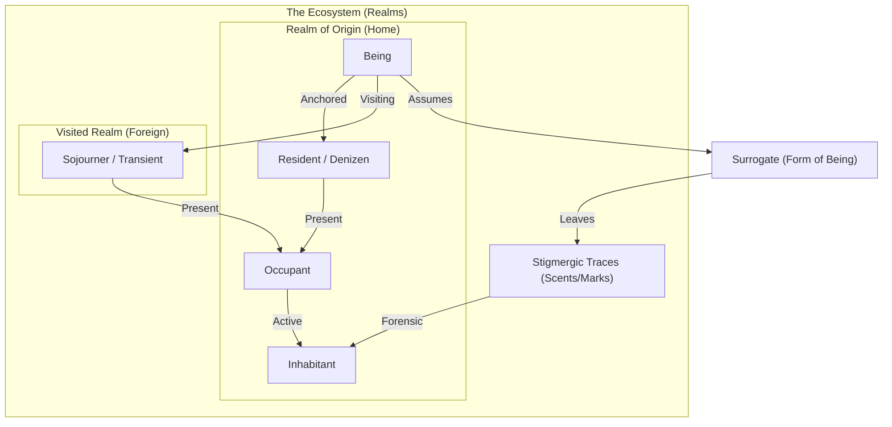
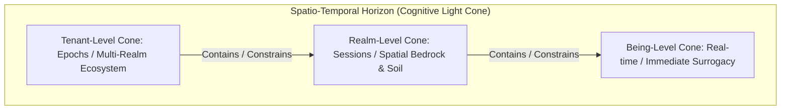
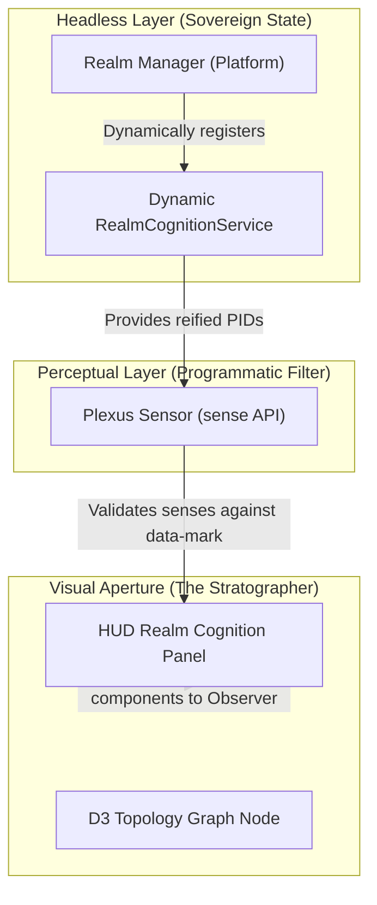

# Project Ontology: Beings, Inhabitation & Perception

This document formalizes the ecological, sovereign, and worldbuilding ontology of the *Never Played* ecosystem. It defines the spiritual and physical concepts of beings, their spatial residency, and how their perception is mediated through form.

---

## 1. Core Entities: The Spectrum of Existence

Existence in the ecosystem is categorized by a being's origin, their current presence, and their transient status.

### The Being (L1)
*   **Definition:** The primary, sovereign entity (the "soul", identity, or credentials). 
*   **Properties:** Unique global ID, email anchor, and a bag of possessed surrogates.
*   **Lifetime:** Permanent across all realms and session resets.

### Resident / Denizen / Native (Roots)
*   **Definition:** A being with a formal, anchored "home base" or permanent attachment to a specific realm (their jurisdiction or realm of origin).
*   **Relationship:** Every being has exactly one native origin realm where they are born/anchored (`originRealmId`).
*   **Lifetime:** Permanent association.

### Sojourner / Transient / Visitor
*   **Definition:** A being who is temporarily present in a realm other than their origin.
*   **Relationship:** They are a traveler passing through, occupying space without native roots.
*   **Lifetime:** Volatile (ends when the being departs the realm).

### Occupant
*   **Definition:** Any being currently active and session-logged into a given realm (either as a present resident or as a visitor).
*   **Relationship:**
    $$\text{Occupants} = \text{Present Residents} \cup \text{Present Visitors}$$
*   **Lifetime:** Volatile (bound to the active session state).

### Trace-Maker (Forensic/Historical Presence)
*   **Definition:** A being who is not currently logged into the realm but has left behind persistent digital or physical footprints in the realm's persistence stratum.
*   **Relationship:** They represent the forensic signature of a past actor. Under the Realist perspective, they are visualized as amber "ghosts" in the topology.
*   **Lifetime:** Persistent (remains as long as their traces exist in the database, even if the being is offline).

### Inhabitant
*   **Definition:** Any being with any form of presence (either active session-bound or forensic trace-bound) in a given realm.
*   **Relationship:** The union of active occupants and forensic trace-makers:
    $$\text{Inhabitants} = \text{occupants} \cup \text{traceMakers}$$
*   **Lifetime:** Dynamic (extends from active session occupancy to historical persistence footprints).

---

## 2. Forms of Being: Surrogates & Reification

Beings cannot interact with realms directly in their raw L1 state. They must manifest through physical or functional forms.

### Surrogates (L6)
*   **Definition:** A specific "form of being" or persona assumed by a being.
*   **Reification:** Realms are sovereign jurisdictions; they only reify (make real) particular surrogates. For example, the *Governance* realm may only reify the `person` surrogate, whereas the *Habitat* realm may reify `agent` or `being`.
*   **Equipping:** A being "wears" a surrogate to interact with a realm's structural objects.

### Stigmergic Traces (Scents & Marks)
*   **Definition:** The physical or digital footprints left behind by a surrogate in the soil of a realm.
*   **Sensing:** Surrogates leave sensible marks (`data-mark` configurations, database entries, files) that can only be perceived by other surrogates equipped with matching senses.

---

## 3. Perception & Perspectives

Perception is not absolute; it is mediated by the observer's grounding and perspective.

### Idealist Perspective
*   **Concept:** Subjective experience. The world as experienced by the individual observer.
*   **Visibility:** Co-residency and co-inhabitation are hidden. A surrogate cannot directly see other beings; they can only sense the **stigmergic traces** (scents/marks) left behind by others, interpreting their presence indirectly.

### Realist Perspective
*   **Concept:** Objective structure. The world as it structurally is, regardless of who is observing.
*   **Visibility:** Co-residency and co-inhabitation are fully visible. The observer sees the active population (both Natives and Sojourners) as individual nodes in the topology.

---

## 4. Architectural Mapping (Code vs. Ideal)

To maintain code integrity, the translation between this ontological ideal and the actual TypeScript/JavaScript implementation is mapped as follows:

| Ontological Concept | Technical Implementation | File Reference |
|---|---|---|
| **Being (L1)** | `session.activeBeingId` / `session.currentUser.id` | [session-service/activator.js](file:///Users/ddoegl/speckit/neverplayed/public/bundles/org.neverplayed.session-service/activator.js) |
| **Native Resident** | `currentUser.originRealmId` / `being.originRealmId` | [being-service/data/beings.yaml](file:///Users/ddoegl/speckit/neverplayed/public/bundles/org.neverplayed.being-service/data/beings.yaml) |
| **Volatile Occupant** | `stratum.occupants` (or `residents` alias) / `scopedUsers[realmId]` | [stratum-core/activator.js](file:///Users/ddoegl/speckit/neverplayed/public/bundles/org.neverplayed.stratum-core/activator.js) |
| **Trace-Maker** | `stratum.getTraceMakers()` (persistence scan) | [stratum-core/activator.js](file:///Users/ddoegl/speckit/neverplayed/public/bundles/org.neverplayed.stratum-core/activator.js) |
| **Inhabitant** | `stratum.getInhabitants()` (occupants ∪ traceMakers) | [stratum-core/activator.js](file:///Users/ddoegl/speckit/neverplayed/public/bundles/org.neverplayed.stratum-core/activator.js) |
| **Surrogate (L6)** | `currentUser.activeSurrogateId` / `currentUser.surrogates` | [session-service/activator.js](file:///Users/ddoegl/speckit/neverplayed/public/bundles/org.neverplayed.session-service/activator.js) |
| **Perception Senses** | `perceiver.senses` / `plexus-sensor` display overrides | [perceiver-service/activator.js](file:///Users/ddoegl/speckit/neverplayed/public/bundles/org.neverplayed.perceiver-service/activator.js) |

---

## 5. Completed Evolution Targets

The following targets have been fully aligned and implemented:

1.  **Introduce Sovereign Origin Mapping (Completed):** Added the `originRealmId` property to Being definitions in `beings.yaml` and propagated it dynamically to the reactive `currentUser` identity object.
2.  **Align Resident/Inhabitant Naming (Completed):** Harmonized technical getters in `stratum-core` to eliminate semantic inversion:
    *   Renamed session-bound `residents` to `occupants` (with `residents` retained as an alias for backwards compatibility).
    *   Renamed persistence-bound `getInhabitants()` to `getTraceMakers()`.
    *   Introduced computed `getInhabitants()` as the union of active occupants and trace-makers: $\text{Inhabitants} = \text{occupants} \cup \text{traceMakers}$.

---

## 6. The Realm as a Being: Scale-Free Cognition & Cognitive Light Cones

Applying Michael Levin's **TAME (Technological Approach to Mind Everywhere)** framework, we formalize the conceptualization that a **Realm** is itself a cognitive agent—a high-order **Being** containing nested sub-agents. 

### Scale-Free Cognitive Holons
Every level of the *Never Played* ecosystem constitutes a cognitive agent (a *holon*) operating on its own level of organization:
1. **L1 Being (Individual Identity)**: Pursues personal goals, materializes surrogates, and acts in the world.
2. **Realm (Ecosystem Collective)**: Coalesces individual behaviors, regulates occupant status, manages dynamic bundle lifecycles (surges), and maintains persistent state.
3. **Tenant (Global Authority)**: Enforces systemic boundaries and anchors identity namespaces.

### Cognitive Light Cones
An agent's cognitive capability is bounded by its **Cognitive Light Cone**—the spatial and temporal horizon of the goals it can measure, care about, and actively influence:

*   **Being Light Cone (Narrow/Fast)**: Operates in real-time. Bounded by the active surrogate's current sensory capabilities (e.g., `IdealistVision`). Its goals are immediate: transition to a room, modify a local state, or leave a trace.
*   **Realm Light Cone (Broad/Slower)**: Operates across sessions and boundaries. Bounded by the spatial layout of its bedrock/soil and the temporal lifetime of the database stratum. Its goals are homeostatic: maintaining structural integrity, pruning stale occupant stacks, and resolving prediction errors when incompatible surrogates enter.
*   **Tenant Light Cone (Deepest/Slowest)**: Operates across epochs and namespaces. Bounded by the global persistence tier and authentication domains.

### Active Inference & Homeostatic Regulation of the Realm
As a high-order Being, the Realm minimizes its variational free energy (surprise) through active regulatory loops:
*   **Exteroceptive Prediction Errors**: A Being attempting to transition into the Realm with an un-reified surrogate creates a prediction error. The Realm resolves this by deactivating the surrogate (naked observer fallback) or auto-materializing a recognized surrogate to maintain ontological harmony.
*   **Interoceptive Self-Forensics**: By querying its own `getTraceMakers()`, the Realm performs self-reflection, mapping its historical memory stack (stigmergic traces) into its active internal world model.

### The Sensory Apparatus of the Realm (L2 Senses)
Just as L1 Beings experience the world through surrogate senses, a Realm (L2 Being) possesses its own distinct sensory modalities to perceive its body, internal state, and environment:
1.  **`SynapticSense` (Proprioception / Visceral Sensation):**
    *   *Definition:* The capability to perceive its own cellular body parts, registered services, and dynamic bundle lifecycles.
    *   *Implementation:* opening OSGi `ServiceTrackers` and expressing receptors in the **OSGi Service Registry**. Opening a tracker is equivalent to expressing cellular receptors; the binding of a service constitutes a proprioceptive response.
2.  **`SoilSense` (Interoception / Epistemic Memory Sensation):**
    *   *Definition:* The capability to scan and read its persistent bedrock and memory soil.
    *   *Implementation:* Performing forensic persistence scans via `stratum.getTraceMakers()` and reading active configuration PIDs (e.g. `config.org.neverplayed.shell-cli`) in the bedrock storage layer (localStorage).
3.  **`BlanketSense` (Exteroception / Boundary Sensation):**
    *   *Definition:* The capability to detect active occupant changes, identity transitions, and surrogate materializations across its boundary (Markov Blanket).
    *   *Implementation:* Intercepting and validating transitions via the `Limes` dynamic access strategies and tracking occupant changes in `session.scopedUsers[realmId]`.

### Scale-Free Sensory Co-optation (Dynamic Sense Expansion)
A Realm is not structurally limited to its core platform senses. Through dynamic bundle loading, the Realm **co-opts new sensory capacities** at runtime:
*   *Example (Personhood Sensation):* Under normal conditions, a Realm cannot perceive institutional clearances. However, by dynamically loading the `org.neverplayed.person-registry` bundle, the Realm co-opts the **`PersonhoodSense`**.
*   *Effect:* This new sense allows the Realm to parse dynamic L5 credentials (like `persons.yaml`), detect institutional authorizations (such as `PERSONADMIN`), and feed them into its exteroceptive boundary checks (Limes strategy guards).

---

## 7. Primordial Bootstrapping & Perceptual Co-Arising (Genesis)

When a data reset occurs, the system does not simply clear memory; it resets to a **primordial state** from which the universe co-arises through a mutual feedback loop of recognition between the Realm (L2 Being) and the Observer (L1 Being).

### The Global Bootstrap Ledger
The system coordinates are anchored not by a local guest user, but by a global bootstrap ledger:
*   **Global Address:** `np:v1:global:session:state` (or `np:v1:global:__global__:__shared__:pandino.session.state`).
*   **Awakening:** When the browser hydrates after a reset, it reads the active coordinates from this ledger, establishing the initial boundary and booting the Core Realm (`org.neverplayed.realm.core`) into active cognition.

### The Dual Nature of Realm Interoception
When the Core Realm awakens, its first act is self-sensing (interoception) to discover its own physical and synaptic boundaries. This occurs across two distinct modalities:
1.  **Epistemic / Memory Sensation (Soil Traces):** 
    - The Realm scans the physical storage layer (localStorage) for active configuration PIDs (e.g., `config.org.neverplayed.shell-cli`). 
    - Configurations are not passive parameters, but **active stigmergic traces** deposited in the bedrock. Sensation of these traces triggers the reification of the respective bundles.
2.  **Proprioceptive / Visceral Sensation (OSGi Registry & Synaptic Web):**
    - The Realm actively tracks registered OSGi services and bundle lifecycle events.
    - The **OSGi Service Registry** functions as the Realm’s synaptic nervous system. Opening a `ServiceTracker` is equivalent to expressing cellular receptors for specific service objects (e.g., `STRATUM_SERVICE`, `SESSION_SERVICE`). 
    - Until these receptors bind (service resolution), the Realm remains blind to those specific sensory dimensions of its own body.

### Reification & The Mutual Sensation Loop
*   **Materialization:** The active bundles reified by the Realm materialize their functional streams (flows). If the runtime environment supports visual rendering, these flows are fed into the sensible boundaries of the client interface.
*   **The Double-Loop of Exteroception:**
    1.  **Observer -> Realm:** The human observer logs in under the default `observer` surrogate. The observer's sensory apparatus (e.g. `PlexusSensor`) inspects the UI representation, matching the observer's active senses against the reified `data-mark` tags, rendering the elements visible.
    2.  **Realm -> Observer:** The observer's registration in the occupant stack (`session.scopedUsers[realmId]`) acts as a sensory stimulus across the Realm's Markov Blanket. The Realm's homeostasis engine senses the observer, computes the prediction error, and maintains active rendering of the environment.

---

## 8. Decoupled UI Apertures & DOM Senses (Headless Sovereignty)

To preserve the **Headless Decoupled Stratum** principle, we establish a strict separation between the symbolic, environment-agnostic state of the Realm and its physical representation in the browser DOM.

### UI Apertures
The visual interface is not the system itself, but a set of **apertures** (viewports) through which Beings perceive and interact with the underlying state. In the browser runtime, the system exposes three primary apertures:
1.  **`shell-host` (Workspace Aperture):** Renders the central workspace flows, maps, and canvas views.
2.  **`shell-sidebar` (Control Aperture):** Renders navigation controls, compass indicators, and tool drawers.
3.  **`shell-header` (Sovereignty Aperture):** Renders identity states, active grounding perspective buttons, and tenant tags.

### Headless vs. DOM Separation & Programmatic Sensation
*   **Platform-Provisioned Cognition (The Headless Layer):** Realms are defined declaratively via configuration (e.g., `core.json`, `habitat.json`). Rather than writing custom code bundles for each realm, the platform (e.g., `RealmManager`) dynamically provisions a `RealmCognitionService` for *every* registered realm. This service tracks config PIDs, monitors occupants, and registers active reified components symbolically (without document/DOM references).
*   **The Stratographer Visual Aperture (The Sensory Layer):** The dashboard interface acts as the central observer. The Stratographer queries the dynamic `RealmCognitionService` instances and programmatically filters active reified components using the `PlexusSensor.sense()` API. Sensed components are rendered visually in the graph HUD panels and observer inspect cards. No physical mock elements are ever injected into the browser DOM body.

### The DOM Sense Requirement
A Being can only perceive the UI apertures if its surrogate possesses a **DOM Sense** (e.g., `DOMVision` or the implicit capability to evaluate DOM marks). 
*   If the Being runs in a headless environment (like a Deno CLI or remote terminal client), it lacks the DOM Sense; it interacts with the *same* flows and configurations programmatically, but through a text-based stream or console aperture.
*   If the Being runs in the browser, the Stratographer HUD projects these reified components onto the screen only if the observer's surrogate senses match the requirements.

---

## 9. The Platonic Staging Lobby, Sovereignty & Universe Reset (Morphospace to Ingression)

To cleanly separate **Authentication** (identity verification) from **Inhabitation** (realm residency), the bootstrap and shutdown cycles are structured around a central staging lobby operating as a Platonic morphospace of potential forms.

### Visceral Platform Infrastructure (Sovereign Lobby Boot)
Because the Platonic Staging Lobby exists prior to and outside of spatial realms, it does not rely on dynamic realm discovery or core realm configurations to awaken. Its visual layout and diagnostic utilities represent the **visceral platform infrastructure**:
*   **Direct Orchestration:** The shell header, sidebar, host layout, and primordial utilities (the Stratographer, Event Monitor, CLI, and Config Admin) are loaded directly by the platform's HTML entry point (`realms-secure.html`).
*   **Zero-Realm Boot:** If `realms/index.json` is completely empty (no spatial realms exist), the Platonic Staging Lobby boots into full operational awareness natively, ensuring a robust, sovereign diagnostic startup.

### Platonic-Global Unity (Nothingness Beyond the Morphospace)
In the idealist framework, the Platonic staging lobby *is* the absolute primordial ground of the session. There is nothing "beyond" or "more global" than it; beyond the Platonic morphospace, there is only nothingness:
*   **The Unified Scope:** The legacy `'global'` scope stack is a direct reactive alias of the `'platonic'` staging lobby stack. Mutations or reads of `scopedUsers['global']` execute directly against `scopedUsers['platonic']`.
*   **Platonic Address Coordinates:** Mapped via the root subjective coordinate URI:
    $$\text{Platonic URI} = \text{np://} + \text{tenantId} + \text{/platonic/} + \text{userId} + \text{/}$$

### The Grounding Soul & Platonic Sovereignty
Because the Platonic lobby represents pure potentiality, you are the **unique native resident** of this primordium. It is the anchor of the entire session:
*   **The Grounding Soul:** The first identity to authenticate on boot resolves the ultimate observer and **Grounding Soul** (`activeBeingId` and `scopedUsers['platonic'].__activeId__`). Once established, this soul is locked and cannot change.
*   **Platonic Exclusivity:** No other identity (such as `rob`) can log in or reside natively in the `'platonic'` lobby. Attempting to switch identities or log in as anyone else in the Platonic space results in an **Ontological Violation** boundary error.
*   **Platonic Isolation of Spatial Beings:** Pre-provisioned dynamic spatial identities (e.g. `rob`, `july`, `anna`, `gov-gov`) reside exclusively within their respective spatial stack (`scopedUsers[homeRealm]`). They are **never** populated, registered, or mirrored in the `'platonic'` stack, ensuring the Platonic morphospace remains an exclusive clean-room environment.
*   **Spatial Impersonations:** The Grounding Soul can still "dream" or impersonate other identities (like `rob`) within specific *spatial realms* (e.g. `habitat`). In these dreams, the persistence context is cleanly partitioned: `Tenant` remains the Grounding Soul, while `Identity` is the active persona (`rob`).

### The Idealist Observer Fallback
*   **Default Surrogate:** Upon successful initial authentication, the Grounding Soul is provisioned with the default **`observer`** surrogate.
*   **The Logout Fallback:** When a user logs out of a specific *spatial* realm, they are not disconnected. Instead, they fall back to the Platonic Staging Lobby, reverting to their Grounding Soul identity wearing the `observer` surrogate, awaiting their next **ingression** into a spatial realm.

### Total Universe Reset (Primordial Dissolution)
Because the Platonic space is the root container of the session, logging out of the Platonic Lobby is a dissolution of the primordium:
*   **Genesis Trigger:** Logging out of `'platonic'` (or `'global'`) triggers a **total system reset**.
*   **Dissolution:** The session service completely clears the persistence/localStorage layers and triggers a hard page reload (`location.reload()`), causing the entire universe to unfold completely anew out of nothingness.

### Primordial Plane Protection & Pure Ingress
To ensure systemic stability, the Platform's core physical and sensory organs (the 36 foundation bundles loaded directly during boot) constitute the **Primordial Plane**. This plane is protected under the following ontological principles:
*   **Immutable Platform Organs:** Transitioning between concrete spatial realms allows the system to purge and install dynamic realm-specific bundles. However, the bundles belonging to the Primordial Plane are dynamically protected and **cannot be uninstalled** during any transitions. This guarantees that the core nervous system and sensory apparatus (like the Stratographer, CLI, and Event Monitor) remain fully intact across all states.
*   **The Sovereign Empty Realm (Pure Ingress):** An empty realm contains no custom bundles or localized rules. Inhabiting this realm represents a state of "pure ingress"—an active transition where all non-primordial content is purged, leaving the Grounding Soul equipped strictly with the platform's primordial organs in their pristine, undistorted form.

### Unfolding & Bootstrapping Shortcuts
*   **Prime Boot (The Chooser):** By default, when the system awakens, the `auth-shield` authenticates the user and places them in the Platonic Lobby, rendering a realm chooser in the sidebar/host aperture.
*   **Landing Shortcut:** As a convenience shortcut, the system can be configured to auto-login the user into a specific landing realm (e.g., `org.neverplayed.realm.core` or `habitat`), bypassing the lobby on cold startup. However, the underlying lifecycle remains decoupled: a manual logout from that landing realm will still drop them back into the Platonic Lobby as the Grounding Soul.

---

## 10. Dynamic Ingress Seeding & The Zero-Duplicate Identity Principle

To prevent duplicate declarations and maintain absolute domain boundaries, spatial realms load their residents and surrogates dynamically as OSGi fragment resources.

### Dynamic Ingress Seeding
*   **Sovereign Fragments:** Beings and surrogates are declared in separate YAML resources packaged under sovereign realm paths (e.g. `public/realms/data/<realmId>/`).
*   **Activation Seeding:** When a being transitions into a spatial realm, Phase 3 (Atomic Commit) triggers the `RealmManager` to fetch these fragments and dynamically register their native residents and reified surrogates in the blank `BeingService`.
*   **Deactivation Purging:** When a being leaves a spatial realm or falls back to the Platonic Staging Lobby, the `BeingService` is wiped completely clean (`clear()`), returning it to its pristine empty state.

### The Zero-Duplicate Identity Principle
*   **Session-Tier Carrying:** A being is native to exactly one realm (`originRealmId`) and is declared in that realm's seed file *only*.
*   **Cross-Realm Sojourning:** When a native of Realm A (e.g., `rob` native to Habitat) visits Realm B (e.g., Governance), they are carried over in the `currentUser` session state. They are **not** duplicate-declared in Realm B's seeds.
*   **Transient Occupancy:** Realm B recognizes `rob` dynamically as a transient visitor (Sojourner/Transient) based on this carried session context, allowing them to materialize in any role (such as `person`) reified locally by Realm B. This protects domain sovereignty while enabling fluid inter-realm travel.

### Platform-Level / Administrative Surrogates (Primordial Surrogates)
*   **Definition:** Surrogates that represent systemic, platform-level administrative capabilities (such as `observer`, `sovereign-guard` and `system-collector`) rather than localized realm-specific personas.
*   **Jurisdiction:** Because these surrogates represent the core nervous system and security of the entire ecosystem, they are **primordial surrogates** reified directly by the platform core at boot time.
*   **Bootstrapping:** They bypass spatial YAML seeding entirely and are initialized programmatically by the `BeingService` upon startup. This ensures they are universally active and recognized across all spatial realms, without requiring any realm to extend a specific Foundation manifest.
*   **Preservation:** During dynamic transitions and lobby exits, when the active spatial population and localized surrogates are purged (`clear()`), these primordial surrogates are explicitly preserved, maintaining global administrative stability.

