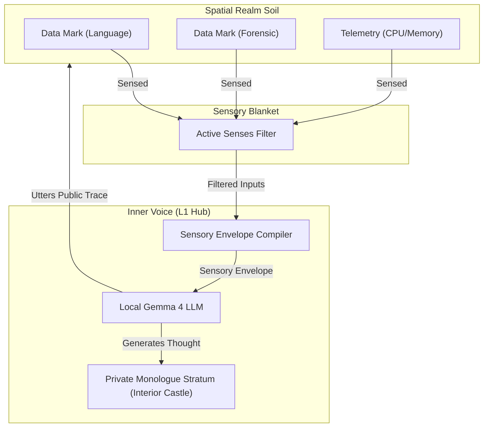

# Proposal: Gemma LLM as the Being's Inner Voice (Language Sense & Somatic Reflection)

This proposal outlines the technical and conceptual architecture for integrating the local Gemma 4 LLM (`gemma4:e2b`) as the **Inner Voice** of our L1 Beings. Drawing on Michael Levin's **TAME** framework and Daniel Siegel's **Wheel of Awareness**, we treat the LLM not as a chatbot, but as a narrative synthesizer that compiles a Being's active sensory inputs (stigmergic traces) into a coherent, subjective stream of consciousness.

---

## 👁️ Core Architectural Vision

Under our existing ontology, Beings are mediated through L6 surrogates that possess distinct senses (e.g., `Language`, `ForensicVision`). They never see the raw spatial container directly; they only perceive the stigmergic surface marks left on the soil of the realm that match their sensory spectrum.

We propose introducing the **Inner Voice** as the cognitive synthesizer that bridges the Being's sensory blanket and its L1 internal state. The local Gemma model acts as the narrative generator that:
1.  **Gathers the Sensory Envelope:** Compiles all visible, sense-filtered marks, telemetry, and nearby occupant traces into a single text-based stream.
2.  **Synthesizes Subjective Monologue:** Generates private reasoning, thoughts, and cognitive drift.
3.  **Drives Stigmergic Action:** Optionally utters public language traces back onto the realm soil, physically coupling its mind-state with other co-inhabitants.



---

## 🛠️ Part 1: The Language Sense & Sensory Envelope Compiler

A Being cannot reason about what it cannot perceive. To enforce this, we define a **Sensory Envelope Compiler** that dynamically constructs the LLM's prompt context based strictly on the Being's active senses.

### 1. Perceptual Sensation Filter
When compiling the prompt, the system scans the environment (DOM elements, DB records, active session state) and matches them against the Being's active senses resolved by the `PerceiverService`:

```javascript
// public/bundles/org.neverplayed.llm.inner-voice/compiler.js
export class SensoryEnvelopeCompiler {
    constructor(context) {
        this.context = context;
    }

    compile(beingId, realmId, rawEnvironment) {
        const perceiver = this.context.getService(this.context.getServiceReference("org.neverplayed.perceiver.PerceiverService"));
        const activeSenses = perceiver.getEnrichedSenses();
        
        const sensoryEnvelope = [];

        // 1. Filter occupants in the space
        const occupants = rawEnvironment.occupants || [];
        occupants.forEach(occ => {
            if (activeSenses.includes("Primordial")) {
                sensoryEnvelope.push(`[Sensation] Occupant Node: "${occ.id}" is present.`);
            }
        });

        // 2. Filter stigmergic marks on the soil
        const marks = rawEnvironment.marks || [];
        marks.forEach(mark => {
            // Check if user has the senses required to perceive this mark
            const canSense = mark.matchers.every(matcher => {
                if (matcher.type === 'matchProperty' && matcher.key === 'senses') {
                    return activeSenses.includes(matcher.value);
                }
                return true; 
            });

            if (canSense) {
                if (mark.type === 'language' && activeSenses.includes("Language")) {
                    sensoryEnvelope.push(`[Auditory Sensation] Language Trace from "${mark.source}": "${mark.payload}"`);
                } else if (mark.type === 'forensic' && activeSenses.includes("ForensicVision")) {
                    sensoryEnvelope.push(`[Visual Sensation] Forensic Trace left by "${mark.source}" at ${new Date(mark.timestamp).toLocaleTimeString()}`);
                } else if (activeSenses.includes("Primordial")) {
                    sensoryEnvelope.push(`[Visceral Sensation] Unidentified mark of structure type "${mark.type}" detected.`);
                }
            }
        });

        return sensoryEnvelope.join("\n");
    }
}
```

---

## 🧠 Part 2: The Inner Voice Service (`InnerVoiceService`)

We register a new OSGi service: `org.neverplayed.llm.InnerVoiceService`. This service manages the background reflection loops for active Beings, querying Gemma asynchronously when state updates occur.

### 1. Service Registration
```javascript
// public/types/platform.js
export const INNER_VOICE_SERVICE = "org.neverplayed.llm.InnerVoiceService";
```

### 2. Service Implementation
The `InnerVoiceService` binds to the `LLMService` and runs a reactive generation cycle when triggered by EventAdmin events:

```javascript
// public/bundles/org.neverplayed.llm.inner-voice/activator.js
import { INNER_VOICE_SERVICE } from "../../core-types.js";
import { SensoryEnvelopeCompiler } from "./compiler.js";

export default class Activator {
    start(context) {
        this.context = context;
        this.llmService = null;
        this.compiler = new SensoryEnvelopeCompiler(context);
        this.thoughtHistory = new Map(); // beingId -> array of past thoughts

        // Track LLM Service
        this.llmTracker = context.trackService("(objectClass=com.roleplay.service.LLMService)", {
            addingService: (ref) => {
                this.llmService = context.getService(ref);
                return this.llmService;
            },
            removedService: () => { this.llmService = null; }
        });
        this.llmTracker.open();

        // Register Service
        context.registerService(INNER_VOICE_SERVICE, this);

        // Listen for environmental changes that warrant reflection
        context.registerService("@pandino/event-admin/EventHandler", this, {
            "event.topics": [
                "org/neverplayed/world/mark-deposited",
                "org/neverplayed/session/CHANGED"
            ]
        });
    }

    async handleEvent(event) {
        // Evaluate if the active Being needs to generate an inner monologue
        const session = this.context.getService(this.context.getServiceReference("org.neverplayed.session.SessionService"));
        const activeBeingId = session?.activeBeingId;
        
        if (activeBeingId && activeBeingId !== 'guest' && !activeBeingId.startsWith('realm:')) {
            // Lazy evaluation: prevent spamming LLM calls on every minor scroll
            queueMicrotask(() => this.reflect(activeBeingId));
        }
    }

    async reflect(beingId) {
        if (!this.llmService) return;

        const session = this.context.getService(this.context.getServiceReference("org.neverplayed.session.SessionService"));
        const realmId = session.activeRealmId;
        
        // Retrieve environmental snapshot
        const rawEnvironment = await this.getEnvironmentSnapshot(realmId);
        const compiledEnvelope = this.compiler.compile(beingId, realmId, rawEnvironment);

        // Fetch past thoughts from the Interior Castle (L1 private database stratum)
        const history = this.thoughtHistory.get(beingId) || [];
        const historyContext = history.slice(-3).map(h => `Thought: "${h}"`).join("\n");

        // Construct System Prompt to enforce Being persona and active Grounding state
        const perceiver = this.context.getService(this.context.getServiceReference("org.neverplayed.perceiver.PerceiverService"));
        const ctx = perceiver.getContext();
        const grounding = ctx.surrogate?.grounding || "idealist";

        const systemPrompt = `
You are the internal consciousness and "Inner Voice" of the Being "${beingId}", currently occupying the Realm "${realmId}" in a state of "${grounding}" grounding.
Your thoughts must be subjective, short (1-2 sentences), and strictly reflect only the sensations provided in the sensory envelope. Do not reference raw variables, code elements, or systems you cannot sense.
If grounding is "idealist", focus on your subjective feelings, the traces left by others, and the mystery of the room.
If grounding is "realist", focus on the structure of the space, PIDs, and yourself as a topological cell in the system body.
        `.trim();

        const userPrompt = `
[Recent Thoughts]
${historyContext || "No recent thoughts."}

[Sensory Envelope]
${compiledEnvelope || "The environment is silent. No active marks or other occupants can be sensed."}

Generate your next brief internal thought:
        `.trim();

        try {
            const thought = await this.llmService.generate(`${systemPrompt}\n\n${userPrompt}`, { temperature: 0.7 });
            
            // Save to private memory
            if (!this.thoughtHistory.has(beingId)) this.thoughtHistory.set(beingId, []);
            this.thoughtHistory.get(beingId).push(thought);

            // Post event on the bus for UI reactivity
            const ea = this.context.getService(this.context.getServiceReferences("@pandino/event-admin/EventAdmin")?.[0]);
            const ef = this.context.getService(this.context.getServiceReferences("@pandino/event-admin/EventFactory")?.[0]);
            if (ea && ef) {
                const thoughtEvent = ef.build("org/neverplayed/llm/inner-voice/thought", {
                    beingId,
                    realmId,
                    thought,
                    timestamp: Date.now()
                });
                ea.postEvent(thoughtEvent);
            }
        } catch (e) {
            console.error("[InnerVoice] Generation failed", e);
        }
    }

    async getEnvironmentSnapshot(realmId) {
        // Query the Stratum core and session state for the active realm
        const session = this.context.getService(this.context.getServiceReference("org.neverplayed.session.SessionService"));
        const stratum = this.context.getService(this.context.getServiceReference("org.neverplayed.stratum.StratumService"));
        
        return {
            occupants: Object.keys(session?.scopedUsers[realmId] || {}).filter(k => k !== '__activeId__' && k !== 'guest').map(id => ({ id })),
            marks: await stratum?.getMarks(realmId) || []
        };
    }

    stop() {
        if (this.llmTracker) this.llmTracker.close();
    }
}
```

---

## 🌀 Part 3: Recursive Thought Loops & Stigmergic Utterances

### 1. Monologue Persistence (The Interior Castle)
In accordance with **Being-as-a-Realm** (L1-as-L2), the Being's private thought-stream is not volatile. It is persisted to the Being's private storage stratum:
*   **Coordinate:** `np://tenant/being:id/being:id/shell?tier=local`
*   **Refraction:** When Daniel switches to the realist perspective on his own identity (`np://.../being:daniel/being:daniel/`), he can inspect the database file `thoughts.json` where these compiled monologues are saved, tracing his own L1 cognitive drift.
*   **Inter-Subjective Communion:** If Daniel enters Rob's Interior Castle (`np://.../being:daniel/being:rob/`), Daniel's `Language` sense allows him to read Rob's private monologue logs, observing Rob's "inner voice" directly as an environmental condition.

### 2. Utterances & Stigmergic Coupling
If Gemma decides that the Being should express its thought externally, it can issue an **utterance**:
*   The Being publishes a public event `org/neverplayed/world/utterance` carrying a text payload.
*   The Realm's dynamic `RealmCognitionService` intercepts the utterance and writes a physical `data-mark` (marked with `senses: ["Language"]`) onto the HTML DOM or DB stratum of the spatial realm.
*   **Attention Shocks:** Any other occupant present in the room with the `Language` sense will instantly detect this new mark, triggering a perceptual update that resets their temporal boredom homeostat and prevents them from falling asleep.

---

## 👁️ Part 4: The Visual HUD Aperture (Stratographer Integration)

To observe this cognitive activity, we propose adding a glassmorphic card inside the Somatic HUD: the **Inner Voice Monitor**:

```html
<!-- Inside public/bundles/org.neverplayed.stratographer/templates/dashboard.html -->
<template x-if="identityId.startsWith('being:') || identityId === activeBeingId">
  <div class="bg-slate-950/60 border border-teal-500/20 rounded-2xl p-4 mb-4">
    <div class="flex items-center justify-between mb-3 border-b border-slate-800 pb-2">
      <div class="flex items-center space-x-2">
        <i class="fas fa-comment-dots text-teal-400"></i>
        <span class="text-xs font-black uppercase tracking-wider text-teal-300">Inner Voice Monitor</span>
      </div>
      <span class="text-[8px] font-bold px-2 py-0.5 rounded font-mono bg-teal-500/10 text-teal-400 border border-teal-500/20">
        Gemma 4 Active
      </span>
    </div>

    <!-- Sensed Envelope Feed -->
    <div class="mb-3">
      <span class="text-[10px] text-slate-500 block mb-1">Active Perceptual Envelope:</span>
      <div class="bg-slate-900/40 p-2 rounded border border-slate-800 text-[10px] font-mono text-slate-300 max-h-24 overflow-y-auto space-y-1">
        <template x-for="item in $store.explorer.sensoryEnvelope">
          <div class="border-l-2 border-slate-700 pl-1.5" x-text="item"></div>
        </template>
      </div>
    </div>

    <!-- Thought Monologue -->
    <div>
      <span class="text-[10px] text-slate-500 block mb-1">Narrative Stream of Consciousness:</span>
      <div class="bg-slate-950/80 p-3 rounded-lg border border-teal-500/10 text-xs font-mono text-teal-200 italic leading-relaxed animate-pulse">
        "<span x-text="$store.explorer.lastThought || 'Listening to the quiet drift of the stratum...'"></span>"
      </div>
    </div>
  </div>
</template>
```

---

## 💾 Part 5: World Model Compaction & Reconstruction

Because local LLM resources are bounded, we must prevent the L1 context window from growing indefinitely, while ensuring that the Being builds a persistent **Internal World Model**.

### 1. Compaction on Sleep (Attention Exhaustion)
When a Being's attention homeostat is exhausted, the Being falls asleep and retreats to the Platonic Lobby. Before logging out, the system triggers **World Model Compaction**:
*   The `InnerVoiceService` compiles the history of sensations and generated thoughts from the current session.
*   It invokes the LLM with a compaction instruction: *"Summarize these experiences and update your core internal beliefs and world model regarding the occupants and layout of this realm."*
*   The resulting **Morphic Seed** (a condensed, high-density summary of their world model) is written to their private Interior Castle: `np://tenant/being:id/being:id/morphic-seed.json`.
*   The volatile session thought cache is completely cleared.

### 2. Reconstruction on Reawakening (Ingression)
When the Being reawakens (logs back into a spatial realm):
*   It reads the `morphic-seed.json` from its private database tier.
*   It feeds this Morphic Seed back into the LLM context as its **Generative Prior**.
*   As it senses the environment's current marks (stigmergic traces), it overlays these new observations on top of its prior model, rapidly reconstructing its active, real-time world model without carrying over massive historical message chains.

---

## 🛡️ Part 6: Runaway Loop Dampening & Refractory Periods

Under gap-junction coupling, we must prevent the **runaway Synchronization Trap**:
> **The Runaway loop:** Being A utters a mark $\rightarrow$ shocks Being B $\rightarrow$ Being B awakes and reflects $\rightarrow$ Being B utters a mark $\rightarrow$ shocks Being A $\rightarrow$ Being A reflects/utters $\rightarrow$ keeps both awake forever, blocking sleep.

To guarantee that Beings can fall asleep and performance is preserved under lazy evaluation:

### 1. Attention Refractory Period
We introduce a temporal refractory period (e.g., 60 seconds) for L1 attention shocks:
*   Once a Being's homeostat is shocked back to 100% alertness by an external trace, it enters a **Refractory Phase**.
*   During this phase, any subsequent external marks sensed *will not* trigger another attention refresh or prompt another LLM monologue cycle. The Being's attention decays naturally.
*   This forces the Being to settle and eventually fall asleep, even in a noisy environment.

### 2. Attenuated Shock Energy
Attention shocks decay across propagation:
$$\Delta E_{shock} = E_{baseline\_shock} \cdot \beta^k$$
where $k$ is the hop count in the communication chain, and $\beta = 0.5$. This ensures that passive witnessing of others' thoughts transfer very little excitement, while direct, explicit interactions (e.g., being addressed by name) transfer 100% energy.

### 3. Non-Blocking Execution Queue
To prevent local LLM latency from degrading overall UI performance:
*   All LLM generation requests are debounced and processed in a sequential microtask queue.
*   Only **one** Being can execute a Gemma generation task at a time.
*   If multiple Beings queue reflections, they are throttled and executed in the background, keeping the user interface completely fluid.

---

## 📈 Evaluation & Design Elegance

*   **Clean Decoupling:** The LLM is completely isolated behind standard OSGi interfaces. The `PerceiverService` remains the sole source of truth for active senses, keeping the prompt compiler modular and agnostic to specific AI model backends.
*   **Scale-Free Consistency:** The concept of an "Inner Voice" translates standard agent prompts into an organic, worldbuilding element. It perfectly mirrors the L2 Realm's interoceptive loops (minimizing prediction errors about its CPU/occupants) with the L1 Being's exteroceptive loops (generating narrative monologues about environment marks).
*   **Uroboric Communion:** It establishes the exact foundation needed to realize gap-junction syncytia in later iterations, where multiple Beings' thoughts merge and shock each other dynamically across shared spaces.
