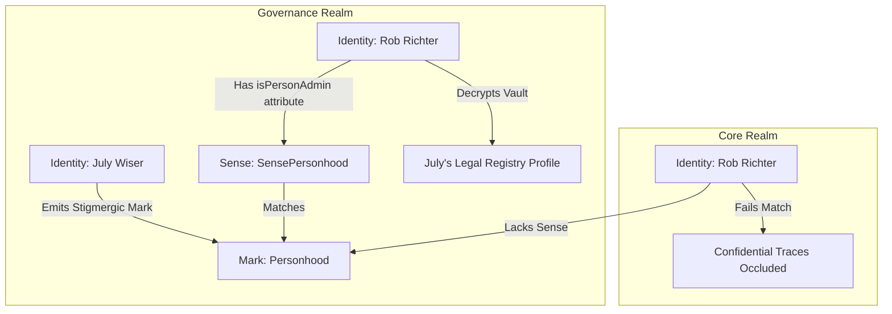

# Proposal: Sensory Spectrum Surfacing & Personhood Proof-of-Concept

This proposal outlines the technical design for **surfacing dynamic, augmented senses** in the Stratographer UI and establishes a concrete **Personhood Sensing Proof-of-Concept (PoC)** to showcase the power of the newly implemented `KNOWLEDGE_PROVIDER_SERVICE` architecture.

---

## 👁️ Part 1: Surfacing Augmented Senses in the Stratographer

Currently, the `KNOWLEDGE_PROVIDER_SERVICE` enriches a being's context during the Plexus evaluation pipeline. However, this enrichment is transient and scoped to the evaluation loop. To make these dynamic senses visible in the UI, we must expose the enrichment pipeline to the `PerceiverService` and Alpine.js.

### 1. The Headless OSGi Extension (Perceiver Service)
We will extend the `PERCEIVER_SERVICE` interface with a new method: `getEnrichedSenses()`. 

When called, the Perceiver Service will:
1. Clone the current active state (Being + Surrogate + Realm).
2. Look up all active `KNOWLEDGE_PROVIDER_SERVICE` registrations in the OSGi registry.
3. Pass the cloned state through the `enrich(context)` pipeline of each provider.
4. Return the complete, dynamically enriched list of senses.

```javascript
// Extended PERCEIVER_SERVICE API
this._perceiverReg = context.registerService(PERCEIVER_SERVICE, {
    // ... current methods ...
    getEnrichedSenses: () => {
        const tempContext = {
            surrogate: JSON.parse(JSON.stringify(this._state.surrogate || { senses: [] })),
            realm: this._state.realm,
            observerMode: this._state.observerMode
        };
        
        // Execute through all registered Knowledge Providers
        this._knowledgeProviders.forEach(provider => {
            if (typeof provider.enrich === 'function') {
                provider.enrich(tempContext);
            }
        });
        
        return tempContext.surrogate.senses || [];
    }
});
```

### 2. The Stratographer UI Extension
In the Stratographer dashboard (`public/bundles/org.neverplayed.stratographer/templates/dashboard.html`), we will introduce a **Sensory Spectrum widget** inside the **Resident Identity card** (Left Panel). 

This widget will dynamically display the active senses, color-coding them to distinguish between **baseline hardware capabilities** and **augmented software layers**:

```html
<!-- Inside the Resident Identity Card -->
<div class="mt-4 pt-3 border-t border-slate-800/50">
  <div class="text-[8px] font-black text-slate-500 uppercase tracking-widest mb-2">
    Active Sensory Spectrum
  </div>
  <div class="flex flex-wrap gap-1.5" x-init="
    // Listen to perceiver shifts to refresh senses
    globalThis.addEventListener('session-changed', () => { activeSenses = ... });
  ">
    <!-- Intrinsic Baseline Senses (e.g. ToolUse, Language) -->
    <template x-for="sense in baselineSenses">
      <span class="bg-slate-800 text-slate-400 text-[8px] px-2 py-0.5 rounded border border-slate-700/30 font-mono font-bold" x-text="sense"></span>
    </template>

    <!-- Enriched Perceptual Lenses (e.g. ForensicVision, SensePersonhood) -->
    <template x-for="sense in augmentedSenses">
      <span class="bg-cyan-500/10 text-cyan-400 text-[8px] px-2 py-0.5 rounded border border-cyan-500/20 font-mono font-bold animate-pulse" x-text="sense"></span>
    </template>
  </div>
</div>
```

---

## 🧬 Part 2: Proof-of-Concept: The Sovereignty of Personhood

To validate the dynamic capabilities of the `KNOWLEDGE_PROVIDER_SERVICE`, we will build a Proof-of-Concept based on the legal concept of **Personhood** in the Governance Realm.

### The Objective
Only authorized entities possessing the `SensePersonhood` capability can perceive the legal status and confidential registry files of other identities. Rather than hardcoding identities, we will **dynamically derive administrative clearance** from the canonical `PERSONADMIN` authorization defined in `persons.yaml`.



### 🛠️ Technical Blueprint

#### 1. The Definitive Registry Source (`persons.yaml`)
The canonical truth of who is a registered person and who possesses administrative clearance remains centralized inside the `person-registry` bundle:

```yaml
# public/bundles/org.neverplayed.person-registry/data/persons.yaml
- id: rob
  firstname: Rob
  lastname: Richter
  authorizations:
    - company: person-registry
      authorizations: ["PERSONADMIN"]
```

When a user session begins, the `person-registry` bundle tracks the `SESSION_SERVICE` and automatically enriches the session user's attributes (via `_enrichSessionUser` in its activator):
- If the being is found in `persons.yaml`, they get `attributes.isRegisteredPerson = true`.
- If their authorizations contain `"PERSONADMIN"`, they get `attributes.isPersonAdmin = true`.

#### 2. The Dynamic Registrar Provider (No Hardcoding)
We create a new bundle or extend the Governance Realm bundle to register a `KNOWLEDGE_PROVIDER_SERVICE`. Instead of hardcoding `"rob"`, it will dynamically check for the `isPersonAdmin` attribute in the active context, injecting `SensePersonhood` only inside the Governance Realm:

```javascript
// public/bundles/org.neverplayed.realm.governance/activator.js
export default class Activator {
    start(context) {
        context.registerService(KNOWLEDGE_PROVIDER_SERVICE, {
            enrich: (ctx) => {
                // Read attribute injected from persons.yaml by the person-registry bundle
                const isPersonAdmin = ctx.isPersonAdmin || ctx.attributes?.isPersonAdmin || false;
                
                // Inject SensePersonhood ONLY when acting in the Governance Realm with admin credentials
                if (isPersonAdmin && ctx.realm?.id === 'org.neverplayed.realm.governance') {
                    if (!ctx.surrogate.senses.includes("SensePersonhood")) {
                        ctx.surrogate.senses.push("SensePersonhood");
                    }
                }
            }
        });
    }
}
```

#### 3. Define the Stigmergic Rule (The Mark)
We define the confidential personhood files in the persistence vault as guarded by a Plexus Stigmergic Mark. Only identities matching the `SensePersonhood` rule can read the values.

```yaml
# public/bundles/org.neverplayed.realm.governance/data/marks.yaml
- id: july-personhood-file
  property: "np:v1:global:governance:july:status"
  matchers:
    - sense: SensePersonhood
```

#### 4. Verification Scenario in the Stratographer
1. **Initial State (Core Realm):**
   - Rob is logged in and active in the Core Bedrock Realm.
   - Rob selects July in the Stratographer.
   - July's legal registry status is protected by the `Personhood` mark.
   - Rob lacks `SensePersonhood`. The Forensic Vault displays: 
     `[Occluded - SensePersonhood Required]`.
2. **Shift State (Governance Realm):**
   - Rob switches to the `org.neverplayed.realm.governance` realm.
   - The Governance Knowledge Provider dynamically injects `SensePersonhood` into Rob's surrogate senses because Rob is a registered `PERSONADMIN` in `persons.yaml`.
   - Rob's new sense immediately lights up in the **Active Sensory Spectrum** widget!
   - Rob selects July. The Plexus Evaluator successfully matches the sense to July's mark, and the Forensic Vault reveals:
     `{ status: "Citizen", passportId: "NP-9821-X", registryDate: "2026-04-12" }`.

---

## 📈 Evaluation & Architectural Purity

- **Sovereign Isolation:** Neither the `BeingService` nor the `SessionService` needs to know anything about `SensePersonhood` or Rob's registry credentials. The entire feature is self-contained in the Governance Realm bundle.
- **Permission-driven Security:** Cleanly derives all capabilities from `persons.yaml` credentials without hardcoding a single identity.
- **Performance:** Context enrichment is a fast, synchronous `O(N)` loop executing prior to D3 topological rendering, introducing zero perceptible latency.
- **Traceability:** The Perceiver Service becomes the single source of truth for both static hardware capability definitions and runtime software augmentations.
