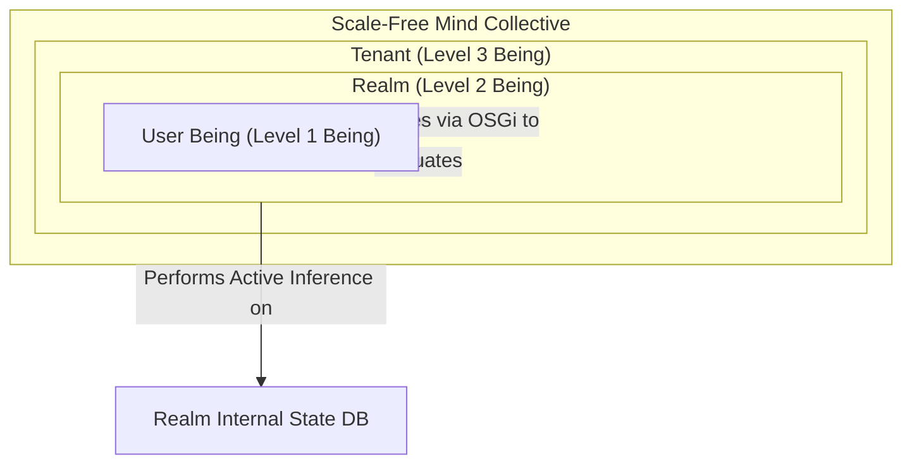

# Proposal: Realm as a Being & Scale-Free Homeostasis Loop (TAME)

This proposal outlines the technical architecture for realizing the **Realm as a Being** conceptualization. By applying Michael Levin's **TAME (Technological Approach to Mind Everywhere)** framework, we treat each Realm as a high-order cognitive agent (a *holon*) possessing its own L1 identity, a bounded Cognitive Light Cone, and an active homeostasis loop to minimize variational free energy (prediction error) within its jurisdiction.

---

## 👁️ Core Architectural Vision

Instead of treating a Realm as a passive spatial database container (a mere stage), we re-classify it as an active **Super-Agent** that:
1.  **Synthesizes an L1 Identity**: Registered as a Being in the identity registry.
2.  **Possesses its own Surrogates**: Equipped with system-level roles (e.g., `SovereignGuard`, `StrataCollector`).
3.  **Executes Active Inference**: Runs a background cognitive loop to monitor prediction errors (anomalies, stale state) and takes homeostatic actions (pruning, reification).



---

## 🛠️ Part 1: Identity & Surrogate Synthesis

To allow a Realm to act as a Being, it must have a representation in the `BeingService` and `SessionService` layers.

### 1. Synthetic Being Identity Registration
We will update the `BeingService` to dynamically synthesize a Being record for each active Realm in the system, preventing manual duplication in `beings.yaml`.

```javascript
// public/bundles/org.neverplayed.being-service/activator.js
export default class Activator {
    // ...
    getBeing(identityId) {
        if (identityId.startsWith('realm:')) {
            const realmId = identityId.substring(6);
            return {
                id: identityId,
                label: `Realm Mind (${realmId.split('.').pop()})`,
                email: `${realmId}@neverplayed.realm`,
                originRealmId: realmId,
                isRealmBeing: true,
                surrogates: ['system-collector', 'sovereign-guard']
            };
        }
        return this._staticBeings.find(b => b.id === identityId);
    }
}
```

### 2. Realm-Specific Surrogates
We register system-level surrogates in `surrogates.yaml` that are restricted strictly to Realm Beings:

```yaml
# public/bundles/org.neverplayed.being-service/data/surrogates.yaml
- id: sovereign-guard
  label: Sovereign Guard
  senses:
    - Language
    - ForensicVision
    - ArchitectControl
    - InhabitantGuardianship

- id: system-collector
  label: Strata Collector
  senses:
    - Language
    - SpaceReclamation
```

---

## 🧬 Part 2: The Homeostasis Loop (The TAME Engine)

Each Realm bundle will run a background **Homeostasis Loop** (the Realm's active cognitive state) to actively minimize free energy (prediction error) within its cognitive light cone.

```mermaid
sequenceDiagram
    participant Loop as Realm Homeostasis Loop
    participant Stratum as Stratum Core (Interoception)
    participant Limes as Limes Guard (Exteroception)
    participant System as System Actions (Active Inference)
    
    loop Every Homeostatic Interval (e.g. 5000ms)
        Loop->>Stratum: Scan inhabitants & persistence drift (Interoception)
        Loop->>Limes: Scan active capabilities & session stack (Exteroception)
        Loop->>Loop: Compute Variational Free Energy (Prediction Error)
        alt Prediction Error > Threshold
            Loop->>System: Execute Active Inference (Homeostatic action)
            Note over System: Prune residency, purge stale traces, trigger bundle surge
        end
    end
```

### 1. The Cognition Service interface
We define a new OSGi service interface: `org.neverplayed.realm.RealmCognitionService`.

```javascript
// public/types/platform.js
export const REALM_COGNITION_SERVICE = "org.neverplayed.realm.RealmCognitionService";
```

### 2. Implementation in the Realm Activator
The Realm bundle implements the cognition service and spawns the homeostasis loop:

```javascript
// public/bundles/org.neverplayed.realm.core/activator.js
export default class Activator {
    start(context) {
        this._context = context;
        this._realmId = "org.neverplayed.realm.core";
        this._predictionError = 0.0;
        
        // Spawn the homeostatic loop (Temporal Cognitive Light Cone = 5s intervals)
        this._loopInterval = setInterval(() => this.homeostasisStep(), 5000);
        
        context.registerService(REALM_COGNITION_SERVICE, this, { realmId: this._realmId });
    }

    stop() {
        clearInterval(this._loopInterval);
    }

    async homeostasisStep() {
        // 1. Interoception: Measure internal state drift (e.g., stale residents)
        const residents = this._stratum?.residents || [];
        const activeUsers = this._session?.scopedUsers[this._realmId] || {};
        
        let predictionError = 0.0;
        const staleResidents = [];

        // Identify occupants who are inactive but still have active session records
        for (const [id, user] of Object.entries(activeUsers)) {
            if (id === '__activeId__' || id === 'guest') continue;
            
            // If occupant has been inactive in session beyond spatial horizon
            if (Date.now() - user.lastActiveTime > 30000) {
                predictionError += 0.5;
                staleResidents.push(id);
            }
        }

        this._predictionError = predictionError;

        // 2. Active Inference: Enact homeostatic actions to minimize error
        if (predictionError > 0) {
            this.logger?.warn(`[${this._realmId}] Prediction error detected (${predictionError}). Executing active inference...`);
            
            // Action: Prune stale residents (Enact self-cleanup)
            staleResidents.forEach(id => {
                this._session.logout(this._realmId, id);
            });
            
            // Re-measure state to verify error reduction
            this._predictionError = 0.0;
            this.logger?.info(`[${this._realmId}] Homeostatic balance restored.`);
        }
    }

    getPredictionError() {
        return this._predictionError;
    }
}
```

---

## 👁️ Part 3: Surfacing Realm Cognition in the Stratographer

To visualize the Realm's high-order cognitive state, we extend the Stratographer D3 graph and information panels:

### 1. D3 Visual Decorators
We render the Realm node with an active **Cognitive Border** that pulses in real-time if its homeostatic balance is disrupted (prediction error > 0):

```javascript
// public/bundles/org.neverplayed.stratographer/activator.js
// Inside _renderGraph()
node.filter(d => d.id.startsWith('realm:'))
    .append("circle")
    .attr("r", 16)
    .attr("fill", "none")
    .attr("stroke", "#a855f7")
    .attr("stroke-width", 2)
    .attr("stroke-dasharray", d => d.predictionError > 0 ? "4,4" : null)
    .append("animate") // Dynamic pulse micro-animation on high prediction error
    .attr("attributeName", "stroke-width")
    .attr("values", d => d.predictionError > 0 ? "2;4;2" : "2;2")
    .attr("dur", "2s")
    .attr("repeatCount", "indefinite");
```

### 2. Realm Cognition HUD Widget
When selecting the active Realm node, the right pane displays the Realm's cognitive stats (its light cone scope, current active surrogate, and homeostatic status):

```html
<!-- Inside public/bundles/org.neverplayed.stratographer/templates/dashboard.html -->
<template x-if="$store.explorer.activeNode?.id?.startsWith('realm:')">
  <div class="bg-slate-950/60 border border-purple-500/20 rounded-2xl p-4 mb-4">
    <div class="flex items-center justify-between mb-3 border-b border-slate-800 pb-2">
      <div class="flex items-center space-x-2">
        <i class="fas fa-brain text-purple-400"></i>
        <span class="text-xs font-black uppercase tracking-wider text-purple-300">Realm Cognition Panel</span>
      </div>
      <span 
        class="text-[8px] font-bold px-2 py-0.5 rounded font-mono border"
        :class="$store.explorer.realmCognition.predictionError > 0 ? 'bg-red-500/10 text-red-400 border-red-500/20 animate-pulse' : 'bg-green-500/10 text-green-400 border-green-500/20'"
        x-text="$store.explorer.realmCognition.predictionError > 0 ? 'Surprise / Drift Detected' : 'Homeostatic Balance'"
      ></span>
    </div>
    
    <div class="space-y-2 text-xs font-mono">
      <div class="flex justify-between">
        <span class="text-slate-500">Cognitive Light Cone:</span>
        <span class="text-slate-300">Session (5000ms) / Spatial Bedrock</span>
      </div>
      <div class="flex justify-between">
        <span class="text-slate-500">Active Surrogate:</span>
        <span class="text-purple-400">sovereign-guard</span>
      </div>
      <div class="flex justify-between">
        <span class="text-slate-500">Prediction Error:</span>
        <span class="text-slate-300" x-text="$store.explorer.realmCognition.predictionError.toFixed(2)"></span>
      </div>
    </div>
  </div>
</template>
```

---

## 📈 Evaluation & Design Elegance

*   **TAME Alignment**: Seamlessly implements scale-free cognition without breaking existing user transitions. The environment becomes a participant in the same lifecycle mechanics that govern human/agent users.
*   **Decoupled Sensation**: The `RealmCognitionService` can be implemented and extended individually by each Realm bundle, allowing the *Governance* realm to run sophisticated, legislative homeostasis checks while the *Habitat* realm runs simple resource reclamation checks.
*   **Variational Free Energy as a Metaphor for Drift**: It translates dry architectural cleanup concepts (e.g., cleaning up database records, purging stale users) into a native worldbuilding/ontological concept (variational free energy minimization), making the code feel like an organic extension of the fiction.
