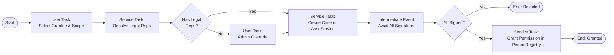

# Ideation: BPMN.js Integration for Flow Definition & Execution

> Status: **Draft / Ideation** — not yet approved for implementation

---

## Motivation

Current flows (e.g. `grant-authorization`) are defined **imperatively in
JavaScript**: the step sequence, guard checks, SCA triggers, case creation, and
routing are all hand-coded inside `activator.js`. This makes flows:

- Hard to visualise without reading code
- Hard to modify without risking regressions
- Not reusable across different contexts (portal vs. retail vs. backoffice)
- Impossible for non-developers to adjust

**bpmn.js** gives us a standards-based, visual notation (BPMN 2.0) to define
what a flow does declaratively. An embedded execution engine then interprets the
BPMN XML at runtime, driving the step sequence, branching, and integration
points.

---

## What Would This Look Like?

### Example: Grant Authorization (current state)

The current flow in `company-authorizations/activator.js` does this
imperatively:

```
[User selects Fellow + Authorization]
       ↓
[assignAuthorization() called]
       ↓
[Resolve legal reps from CompanyRegistry]
       ↓
[Create Case (AUTH-xxx) in CaseService with pending signatures]
       ↓
[Navigate to case-details view]
```

### Same flow as BPMN



---

## Architecture: Three Layers

### Layer 1 — BPMN Definition (`.bpmn` file per bundle)

Each OSGi bundle that defines a process-driven flow ships a `.bpmn` XML file
alongside its `activator.js`. The BPMN file is the **source of truth** for the
process shape. The activator registers the file path with a
`PROCESS_DEFINITION_SERVICE`.

```
bundles/flows/company-authorizations/
  activator.js          ← registers flow + BPMN file path
  grant-authorization.bpmn ← process definition
  templates/            ← HTML templates for User Tasks
```

### Layer 2 — BPMN Runtime Engine (OSGi Bundle)

A dedicated `bpmn-engine` bundle (or thin wrapper over an existing lib):

- **Library options**: [`bpmn-engine`](https://github.com/paed01/bpmn-engine)
  (Node/browser), or a custom interpreter over bpmn-moddle
- Reads `.bpmn` XML, creates a process instance
- Manages token state, exclusive gateways, boundary events
- Dispatches Task execution requests via OSGi events or direct service calls
- Persists instance state via the existing `PersistenceManager`

```js
// index.html or bpmn-engine bundle
context.registerService('bpmn.engine', {
    createInstance(definitionXml, context) { ... },
    resume(instanceId) { ... }
});
```

### Layer 3 — Task Handlers (Service Tasks & User Tasks)

| BPMN Element           | Handled By                                                      |
| ---------------------- | --------------------------------------------------------------- |
| **Service Task**       | OSGi service referenced by `camunda:type` or custom attribute   |
| **User Task**          | HTML template rendered by the portal's `onContentReady`         |
| **Exclusive Gateway**  | Engine evaluates condition expression against process variables |
| **Intermediate Event** | Case service polling / EventAdmin subscription                  |

Service tasks map directly to existing OSGi services:

```xml
<bpmn:serviceTask id="CreateCase" name="Create Case"
    camunda:expression="${caseService.addCase(execution)}" />
```

The engine resolves `caseService` from the OSGi service registry using a custom
expression resolver.

---

## OSGi Integration Points

### `PROCESS_DEFINITION_SERVICE`

A new shared type. Bundles register their BPMN definitions here:

```js
context.registerService('bpmn.process.definition', {
    id: 'grant-authorization',
    title: 'Grant Authorization',
    bpmnUrl: './bundles/flows/company-authorizations/grant-authorization.bpmn',
    initialVariables: (params) => ({ companyId: params.companyId, ... })
}, { 'process.id': 'grant-authorization' });
```

### User Task Rendering

When the engine reaches a User Task, it fires a `bpmn/task/user` event via
EventAdmin. The portal's `onContentReady` intercepts this and renders the
matching HTML template:

```js
// engine emits:
eventAdmin.postEvent('bpmn/task/user', {
    taskId: 'SelectGrantee',
    instanceId: 'inst-123',
    variables: { companyId: 'bikevalue' }
});

// portal listens and loads template:
templates/SelectGrantee.html  ← form-based, submits via state.completeTask(vars)
```

### `state.completeTask(variables)`

A new method on process-backed flow states. Resumes the engine token with output
variables:

```js
state.completeTask({ authId: "sign-authority", validFrom: "2026-01-01" });
```

---

## Phased Approach

### Phase 1 — Visualisation Only (no execution)

- Embed bpmn.js **viewer** (read-only) as a backoffice panel
- Load `.bpmn` files registered by bundles
- Useful immediately for documentation and communication

### Phase 2 — Execution for New Simple Flows

- Implement `bpmn-engine` bundle with Service Task + Gateway support
- Apply to a greenfield flow (not grant-authorization) as a pilot
- Validate OSGi service resolution and state persistence

### Phase 3 — Migrate grant-authorization

- Replace `assignAuthorization()` imperative logic with a BPMN process instance
- Keep HTML templates as-is, just driven by User Task events
- Introduce `WaitForSignatures` as a persistent intermediate event backed by
  CaseService

---

## Concrete bpmn.js Integration

bpmn.js is primarily a **modeller/renderer** (not an execution engine). For
execution, consider:

| Library                | Role                     | Browser-compat    |
| ---------------------- | ------------------------ | ----------------- |
| `bpmn-js`              | Visual modeller + viewer | ✅                |
| `bpmn-moddle`          | Parse/write BPMN XML     | ✅                |
| `bpmn-engine` (paed01) | Execution engine         | ✅ (with bundler) |
| Custom micro-engine    | Lightweight token runner | DIY, minimal deps |

For the prototyper's no-bundler ESM architecture, a **custom micro-engine** is
likely simplest: parse the BPMN XML using `bpmn-moddle`, walk the flow nodes,
and delegate each task type to registered handlers.

---

## Open Questions

1. **Persistence granularity** — how much process state needs to survive a page
   reload? (full instance state vs. last stable step only)
2. **Error boundary** — who handles a failed Service Task? OSGi retry, case
   escalation, or manual fallback?
3. **Parallel tasks** — do authorization flows ever need parallel gateway splits
   (e.g. two signers in parallel)?
4. **BPMN editor in backoffice** — is the visual editor in-app for business
   users, or only a dev-time tool?
5. **Versioning** — can an in-flight process instance survive a BPMN definition
   update?

---

## Summary

| Concern              | Current (Imperative)   | With BPMN                  |
| -------------------- | ---------------------- | -------------------------- |
| Flow definition      | Code in `activator.js` | `.bpmn` XML file           |
| Visualisation        | None                   | bpmn.js viewer             |
| Branching logic      | `if/else` in JS        | Exclusive gateways in BPMN |
| Integration points   | Direct service calls   | Service task handlers      |
| Business user access | None                   | BPMN modeller (Phase 3+)   |
| Persistence          | Manual per flow        | Centralised engine state   |
