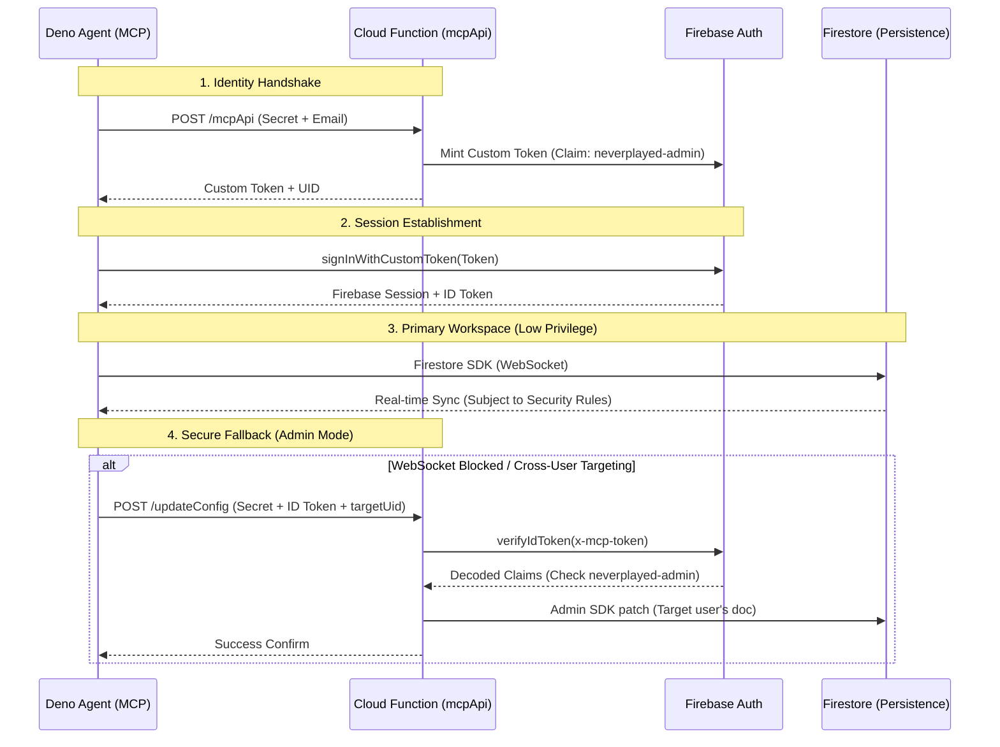

# Security Architecture: Headless Firebase Persistence 🛡️🛰️

This document outlines the resilient, dual-mode connectivity and security framework for headless Deno-based MCP agents in the Never Played universe.

## 1. Overview

The architecture ensures that headless agents can maintain persistent state in Firestore even when operating in firewalled or restricted network environments (e.g., corporate proxies that block WebSockets).

### Core Components
*   **Deno Agent (MCP Server)**: The client process running locally.
*   **Auth Shield (OSGi Bundle)**: Orchestrates the identity handshake.
*   **Firebase Persistence (OSGi Bundle)**: Manages real-time Firestore synchronization.
*   **MCP API Bridge (Cloud Function)**: A dual-purpose gateway for token minting and administrative fallback.

---

## 2. Dual-Mode Connectivity

The system implements a "Double-Fallback" strategy to ensure 100% write availability.

### Mode A: Real-Time Path (Preferred)
*   **Protocol**: WebSockets (Firestore SDK).
*   **Identity**: Uses a **Firebase Custom Token** minted by the `mcpApi` function.
*   **Authorization**: Bound by standard **Firestore Security Rules**.
*   **Privilege**: **Low**. The agent can only read/write to its own UID (`mcp-agent-mcp`).

### Mode B: Stateless Fallback (Failsafe)
*   **Protocol**: HTTPS POST (REST-like).
*   **Identity**: Uses an **authenticated Firebase ID Token** passed in the `x-mcp-token` header.
*   **Authorization**: Bypasses Firestore rules via the **Firebase Admin SDK**.
*   **Privilege**: **High (Admin Mode)**. Allows the agent to perform maintenance on other users' configurations when explicitly commanded.

---

## 3. The Security Handshake 🤝

The following sequence diagram illustrates the hardened authentication flow:

---

## 4. Key Security Controls

### 4.1. Secrets Management
*   **`x-mcp-secret`**: A static header shared between the agent and the Cloud Function. Prevents random public discovery of the endpoint.
*   **GCP Secret Manager**: (Recommended) Store the secret in Secret Manager instead of code.

### 4.2. Cryptographic Identity
*   **ID Token Verification**: The `mcpApi` function verifies the `x-mcp-token` using `admin.auth().verifyIdToken()`. This ensures that even the fallback path requires a valid, current Firebase session.
*   **Custom Claims**: The `neverplayed-admin` claim is attached during token minting. The bridge verifies this claim before allowing writes to any UID other than the agent's own.

### 4.3. IAM Infrastructure & Token Signing
*   **Service Account Token Creator**: The Cloud Function's service account (`27160798303-compute@developer.gserviceaccount.com`) must have this role.
*   **Identity Resolution**: In 2nd Gen Cloud Functions, `admin.initializeApp()` should explicitly specify the `serviceAccountId` of the runtime identity to enable `createCustomToken` signing.

### 4.4. Secret Manager Integration
*   **`MCP_API_SECRET`**: Stored in Google Cloud Secret Manager.
*   **Injection**: The `mcpApi` function is deployed with the `secrets: ["MCP_API_SECRET"]` option, making it available as an environment variable (`process.env.MCP_API_SECRET`).
*   **Rotation**: Rotating the secret in GCP automatically secures the bridge without a code change.

---

## 5. Troubleshooting Reference

*   **Custom Token Refused (500)**: Check if the `Service Account Token Creator` role has propagated to the Compute Engine default service account.
*   **Forbidden (403)**: Ensure the agent is successfully signing in and passing the `x-mcp-token` in the fallback header.
*   **Firestore Permission Denied**: Check Firestore Security Rules for the `mcp-agent-mcp` UID.

> [!IMPORTANT]
> The **Stateless Fallback** is a strictly administrative path. In standard operation, the agent should always prefer the **Real-Time Path** for its own state management to maintain reactive consistency with other clients.
