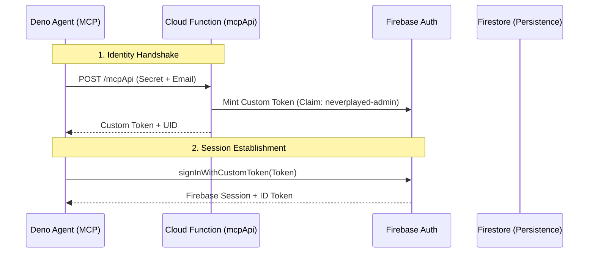

# 🛡️ Auth Shield Bundle

Peripheral bridge for authentication and authorization, primarily integrating with Firebase for identity services.

## 🏛️ Architecture & Implementation

- **Service-Driven**: Registers the `AUTH_SHIELD_SERVICE` as the primary identity provider for the shell.
- **Identity Injection**: Injects `globalThis.NEVERPLAYED_GET_ID_TOKEN()` for cross-bundle authorization (adhering to [ADR-0025](../../docs/adr/0025-identity-injection-id-tokens.md)).
- **Identity Restoration**: Reactive re-assertion of the primary certified identity (Google/Firebase) whenever a temporary global session ends ([ADR-0140](../../docs/adr/0140-sovereign-shield.md)). 🛡️👤
- [ADR-0026](docs/adr/0026-reactive-non-destructive-variable-resolution.md) - Non-destructive variable resolution.
- [ADR-0027](docs/adr/0027-semantic-bundle-versioning-strategy.md) - Semantic versioning for bundles.

## 🏛️ The Patterns (The State)

- **[Platform Alignment](../../docs/platform-patterns.md)**: Implements **Identity Injection** (Pattern 22) and **Constant Compliance** (Pattern 3/ADR-0013).
- **[ADR-0009: Security Naming Convention](../../docs/adr/0009-security-naming-convention.md)**: Enforces the `security.*` prefix for all keys in the `SessionService` to ensure zero-disk persistence.
- **[ADR-0015: Managed Privilege Injection](../../docs/adr/0015-managed-privilege-injection.md)**: Standardizes the injection of claims like `neverplayed-admin` into the shell lifecycle.

### The Security Handshake 🤝
The following hardened authentication flow establishes identity and allows for headless shunting:

## 🚀 Future Road

- **Pluggable Providers**: Abstract the Firebase specific logic into a `CREDENTIAL_PROVIDER` service to allow local-only login or OIDC integration.
- **MFA Support**: Integrated multi-factor authentication flows within the Shell UI.

### Referenced Constants:
- `LOG_SERVICE`
- `SHELL_COMMAND_SERVICE`
- `SESSION_SERVICE`
